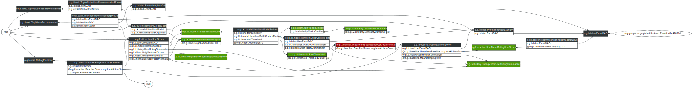

# Item-Item Collaborative Filtering 

[org.grouplens.lenskit.knn.item]: http://lenskit.grouplens.org/apidocs/org/grouplens/lenskit/knn/item/package-summary.html

LensKit provides flexible, performant implementation of item-item collaborative filtering [Sarwar et al. 2001; Deshpande and Karypis 2004] as part of the `lenskit-knn` module, in the [org.grouplens.lenskit.knn.item][] package.

## Quick Start

The LensKit archetypes provide a basic item-item CF configuration that performs pretty well on the MovieLens data sets:

```groovy
// configure the item scorer
bind ItemScorer to ItemItemScorer
// set up a baseline predictor
bind (BaselineScorer,ItemScorer) to ItemMeanRatingItemScorer
// use the baseline for normalizing user ratings
bind UserVectorNormalizer to BaselineSubtractingUserVectorNormalizer
// the default neighborhood size is 20, so the next line isn't technically needed
set NeighborhoodSize to 20
```

## Configuration points

LensKit's item-item implementation is highly configurable.  It can be adapted to many different proposed variations and have components swapped out for new experiments.

Alternative component implementations can add additional configuration points, but this section documents many of the common ones.  Parameters are denoted `@Param`, and component types are listed alone as `ComponentType`.

### Scorer/Predictor

[ItemItemScorer]: http://lenskit.grouplens.org/apidocs/org/grouplens/lenskit/knn/item/ItemItemScorer.html
[ItemItemRatingPredictor]: http://lenskit.grouplens.org/apidocs/org/grouplens/lenskit/knn/item/ItemItemRatingPredictor.html

The [ItemItemScorer][] class is the main driver for the item-item implementation and its configuration.  Configuring it as your item scorer is the primary way to configure that item-item CF is to be used.  It has a couple direct parameters and dependencies that can be configured:

[NeighborhoodSize]: http://lenskit.grouplens.org/apidocs/org/grouplens/lenskit/knn/params/NeighborhoodSize.html
[DefaultItemScoreAlgorithm]: http://lenskit.grouplens.org/apidocs/org/grouplens/lenskit/knn/item/DefaultItemScoreAlgorithm.html
[UserHistorySummarizer]: http://lenskit.grouplens.org/apidocs/org/grouplens/lenskit/data/history/UserHistorySummarizer.html
[Rating]: http://lenskit.grouplens.org/apidocs/org/grouplens/lenskit/data/event/Rating.html
[EventCountUserHistorySummarizer]: http://lenskit.grouplens.org/apidocs/org/grouplens/lenskit/data/history/EventCountUserHistorySummarizer.html

- `@NeighborhoodSize`: [NeighborhoodSize][] sets how many neighbors to use for each prediction.  This is actually declared as a dependency of [DefaultItemScoreAlgorithm][], but most of the time that implementation detail doesn't matter.
- `UserHistorySummarizer`: The summarizer (see [UserHistorySummarizer][]) is used to extract score vectors from user histories.  When using the rating predictor, these vectors should be rating vectors.  The default summarizer uses all the user's [Rating][] events to construct a rating vector.  Bind this to [EventCountUserHistorySummarizer][] to use event (e.g. purchase) counts in an implicit feedback context.

### Model Builder

[ItemItemModelBuilder]: http://lenskit.grouplens.org/apidocs/org/grouplens/lenskit/knn/item/model/ItemItemModelBuilder.html

The item-item CF model (similarity matrix) is built by [ItemItemModelBuilder][].  This is, of course, also configurable.

[ItemSimilarity]: http://lenskit.grouplens.org/apidocs/org/grouplens/lenskit/knn/item/ItemSimilarity.html
[ItemVectorSimilarity]: http://lenskit.grouplens.org/apidocs/org/grouplens/lenskit/knn/item/ItemVectorSimilarity.html
[VectorSimilarity]: http://lenskit.grouplens.org/apidocs/org/grouplens/lenskit/vectors/similarity/VectorSimilarity.html
[SimpleSimilarityMatrixAccumulatorFactory]: http://lenskit.grouplens.org/apidocs/org/grouplens/lenskit/knn/item/model/SimpleSimilarityMatrixAccumulatorFactory.html
[Threshold]: http://lenskit.grouplens.org/apidocs/org/grouplens/lenskit/transform/threshold/Threshold.html
[BaselineSubtractingUserVectorNormalizer]: http://lenskit.grouplens.org/apidocs/org/grouplens/lenskit/transform/normalize/BaselineSubtractingUserVectorNormalizer.html
[DefaultUserVectorNormalizer]: http://lenskit.grouplens.org/apidocs/org/grouplens/lenskit/transform/normalize/DefaultUserVectorNormalizer.html
[MeanVarianceNormalizer]: http://lenskit.grouplens.org/apidocs/org/grouplens/lenskit/transform/normalize/MeanVarianceNormalizer.html
[IdentityVectorNormalizer]: http://lenskit.grouplens.org/apidocs/org/grouplens/lenskit/transform/normalize/IdentityVectorNormalizer.html

- `ItemSimilarity`: The [ItemSimilarity][] component specifies the similarity function used to compare items.  The default implementation is [ItemVectorSimilarity][], which uses a general [VectorSimilarity][] to compare the item's score (rating) vectors.  The default `VectorSimilarity`, in turn, is cosine similarity.
- `Threshold`: A [Threshold][] that determines what item similarities are to be kept. By default, all positive similarities are considered for the model.
- `@ModelSize`: The maximum number of neighbors to retain in the model for each item.  If 0 (the default as of LensKit 1.1), then all neighbors that pass the threshold are kept.

Indirectly, it also makes use of the following configuration points:

- `UserVectorNormalizer`: A normalization applied to user rating vectors before item similarities are computed. Interesting implementations of this class include [BaselineSubtractingUserVectorNormalizer][], which subtracts the baseline score from each rating value, and [DefaultUserVectorNormalizer][] (the default) with its `VectorNormalizer` bound to [MeanVarianceNormalizer][] or [IdentityVectorNormalizer][] (the default).
- `UserHistorySummarizer`: The summarizer for building user vectors for item similarity computation. By default, extracts rating vectors. If you don't do anything special using context-dependent bindings, the same user history summarizer will be used for both the model build and item scoring phases.

### Similarity function

When using the default item similarity function, which delegates to a vector similarity, there are a couple of interesting parameters to configure on it:

[SimilarityDamping]: http://lenskit.grouplens.org/apidocs/org/grouplens/lenskit/vectors/similarity/SimilarityDamping.html

- `VectorSimilarity`: The vector similarity function, such as cosine or Pearson, to compare item vectors. This is used to allow both item and user similarities to reuse the same general vector similarity functions.
- `@SimilarityDamping`: Many similarity functions take a [SimilarityDamping][] parameter, which shrinks the similarity towards 0 when comparing vectors with few users in common.

### More sophisticated configuration

These are just the basic configuration points. Many components can be replaced (explore the JavaDoc and sources to see what all classes are in play), which may result in many more configuration possibilities. In our [RecSys 2012 paper](http://bitbucket.org/grouplens/lenskit-recsys2012), we replaced the entire `ItemItemModel`  with an alternate implementation based a Lucene index of movie tags, allowing us to re-use the `ItemItemScorer` to do tag-based recommendation.

### Diagram

This diagram shows the objects involved in a standard item-item configuration.  Right-click it and view the image for a better view.



## References

1. Mukund Deshpande and George Karypis. 2004. [Item-based top-N recommendation algorithms](http://doi.acm.org/10.1145/963770.963776). *ACM Trans. Inf. Syst*. 22, 1 (January 2004), 143-177.
2. Badrul Sarwar, George Karypis, Joseph Konstan, and John Riedl. 2001. [Item-based collaborative filtering recommendation algorithms](http://doi.acm.org/10.1145/371920.372071). In *Proc. ACM WWW '01*. ACM, New York, NY, USA, 285-295.
