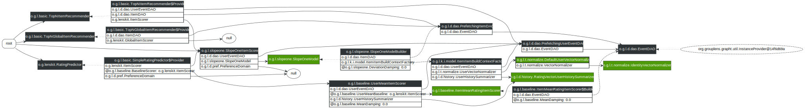

# Slope-One Recommenders

[org.grouplens.lenskit.slopeone]: http://lenskit.grouplens.org/apidocs/org/grouplens/lenskit/slopeone/package-summary.html

LensKit provides an implementation of the [Slope One](http://arxiv.org/abs/cs/0702144) rating prediction algorithm as part of the `lenskit-slopeone` module, in the [org.grouplens.lenskit.slopeone][] package.

## Quick Start

The simplest way to use the Slope One algorithm in a recommender is to bind the `ItemScorer` class to `SlopeOneItemScorer`. A simple configuration for a Slope One recommender is given below:

~~~groovy
bind ItemScorer to SlopeOneItemScorer
bind (BaselineScorer,ItemScorer) to UserMeanItemScorer
bind (UserMeanBaseline,ItemScorer) to ItemMeanRatingItemScorer
set DeviationDamping to 0.0d
~~~

## Using the Weighted Slope One Algorithm

LensKit also offers an improved version of the standard Slope One algorithm that accounts for the number of coratings for each item pair. Items with more coratings are then weighted more heavily when the algorithm generates rating predictions. This version of the algorithm is implemented by the `WeightedSlopeOneItemScorer`.

## Model Builder

[SlopeOneModel]: http://lenskit.grouplens.org/apidocs/org/grouplens/lenskit/slopeone/SlopeOneModel.html

[SlopeOneModelBuilder]: http://lenskit.grouplens.org/apidocs/org/grouplens/lenskit/slopeone/SlopeOneModelBuilder.html

The backing [SlopeOneModel][] is produced by the [SlopeOneModelBuilder][] by default. This is configurable, meaning an alternate builder may be used if desired.

The [SlopeOneModel][] consists of two matrices, one to store deviation values and another to store corating counts for each item pair. The same model can be used for both the normal and weighted variants of the Slope One algorithm.

## Other Configuration Points

[Deviation Damping]: http://lenskit.grouplens.org/apidocs/org/grouplens/lenskit/slopeone/DeviationDamping.html

- `@DeviationDamping`: The only configurable parameter for Slope One is [Deviation Damping][]. This is a constant value that is added to the number of coratings when calculating the deviation of an item pair. The default value for this parameter is 0.

  
## Diagram

