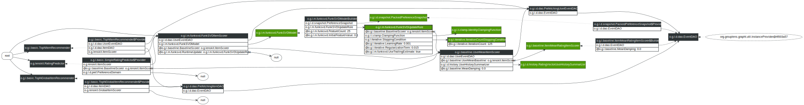

# Matrix Factorization CF

[org.grouplens.lenskit.mf.funksvd]: http://lenskit.grouplens.org/apidocs/org/grouplens/lenskit/mf/funksvd/package-summary.html
[FunkSVD]: http://sifter.org/~simon/journal/20061211.html

LensKit provides an implementation of [FunkSVD][], an SVD-like collaborative filtering algorithm that uses gradient descent to learn a matrix factorization.  This code lives in the `lenskit-svd` module, under the [org.grouplens.lenskit.mf.funksvd][] package.

## Quick Start

[FunkSVDItemScorer]: http://lenskit.grouplens.org/apidocs/org/grouplens/lenskit/mf/funksvd/FunkSVDItemScorer.html
[ItemScorer]: http://lenskit.grouplens.org/apidocs/org/grouplens/lenskit/ItemScorer.html

Configuring [FunkSVDItemScorer][] as your [ItemScorer][] implementation is the main thing to do to use FunkSVD.  There are, of course, other knobs you can tweak as well.  This configuration will train 25 features for 125 iterations each, using the default learning rate and regularization:

~~~groovy
bind ItemScorer to FunkSVDItemScorer
bind BaselinePredictor to ItemUserMeanPredictor
set FeatureCount to 25
set IterationCount to 125
~~~

## Configuration Points

As with all LensKit algorithms, the FunkSVD implementation is highly configurable to allow you to experiment with a wide variety of variants and configurations.  This section describes the primary configuration points for customizing the default components that drive the FunkSVD implementation.

[FunkSVDUpdateRule]: http://lenskit.grouplens.org/apidocs/org/grouplens/lenskit/mf/funksvd/FunkSVDUpdateRule.html
[FunkSVDModel]: http://lenskit.grouplens.org/apidocs/org/grouplens/lenskit/mf/funksvd/FunkSVDModel.html
[FunkSVDModelBuilder]: http://lenskit.grouplens.org/apidocs/org/grouplens/lenskit/mf/funksvd/FunkSVDModelBuilder.html
The FunkSVD item scorer uses a [FunkSVDModel][], which in turn is built by [FunkSVDModelBuilder][].  The model builder JavaDoc is the starting point for discovering most of the configuration points for training the model.  Both the model and the scorer use a [FunkSVDUpdateRule][] to do training updates; this component cannot be directly replaced at present, but transitively depends on many of the other configuration variables that control FunkSVD.

Here are some of the additional configuration points (‘@’ indicates a parameter to be set with `set` rather than `bind`):

[@BaselineScorer]: http://lenskit.grouplens.org/apidocs/org/grouplens/lenskit/baseline/BaselineScorer.html
[@FeatureCount]: http://lenskit.grouplens.org/apidocs/org/grouplens/lenskit/mf/funksvd/FeatureCount.html
[@InitialFeatureValue]: http://lenskit.grouplens.org/apidocs/org/grouplens/lenskit/mf/funksvd/InitialFeatureValue.html
[@LearningRate]: http://lenskit.grouplens.org/apidocs/org/grouplens/lenskit/iterative/LearningRate.html
[@RegularizationTerm]: http://lenskit.grouplens.org/apidocs/org/grouplens/lenskit/iterative/RegularizationTerm.html
[org.grouplens.lenskit.iterative]: http://lenskit.grouplens.org/apidocs/org/grouplens/lenskit/iterative/package-summary.html
[StoppingCondition]: http://lenskit.grouplens.org/apidocs/org/grouplens/lenskit/iterative/StoppingCondition.html
[IterationCountStoppingCondition]: http://lenskit.grouplens.org/apidocs/org/grouplens/lenskit/iterative/IterationCountStoppingCondition.html
[@IterationCount]: http://lenskit.grouplens.org/apidocs/org/grouplens/lenskit/iterative/IterationCount.html

- [@BaselineScorer][] — the FunkSVD algorithm learns to predict residuals from a baseline; the baseline scorer configures what that baseline is.  `UserMeanItemScorer` with a baseline of `ItemMeanRatingItemScorer` is a good choice, and corresponds to Funk's original design.
- [@FeatureCount][] — the number of latent features to learn.
- [@InitialFeatureValue][] — the initial value to use for every user-feature and item-feature value.  The default of 0.1 is probably suitable for most applications.
- [@LearningRate][] — the gradient descent learning rate.
- [@RegularizationTerm][] — the coefficient on the regularization term used to prefer small user-feature and item-feature values.
- [StoppingCondition][] — the condition used to stop the training loop for each feature.  The default stopping condition is [IterationCountStoppingCondition][], which stops after a fixed number of epochs (controlled by [@IterationCount][]).  There are other stopping conditions in [org.grouplens.lenskit.iterative][].

By default, FunkSVD will clamp each feature's contribution to the rating range.  To disable this, hide the rating range:

~~~groovy
within (FunkSVDUpdateRule) {
    bind PreferenceDomain to null
}
~~~

### Runtime Training

By default, all user-feature values are computed when the model is built and these pre-computed user profiles are used to generate scores.  The item scorer does, however, support updating (or computing fresh) the user's feature scores based on their most current profile.  To enable this, bind the `@RuntimeUpdate`-qualified update rule:

~~~groovy
bind (RuntimeUpdate, FunkSVDUpateRule) to FunkSVDUpdateRule
~~~

You can also use context-sensitive bindings to customize runtime (score-time, as opposed to model-time) updating:

~~~groovy
within (RuntimeUpdate, FunkSVDUpdateRule) {
    bind StoppingCondition to ThresholdStoppingCondition
}
~~~

## Diagram

The FunkSVD algorithm is shown below:

