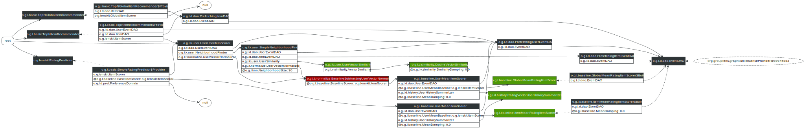

# User-User Collaborative Filtering

[org.grouplens.lenskit.knn.user]: http://lenskit.org/apidocs/org/grouplens/lenskit/knn/user/package-summary.html

LensKit provides an implementation of user-user collaborative filtering, the original automatic collaborative filtering algorithm [Resnick et al., 1994].  This code lives in the `lenskit-knn` module, under the [org.grouplens.lenskit.knn.user][] package.

## Quick Start

[UserUserItemScorer]: http://lenskit.org/apidocs/org/grouplens/lenskit/knn/user/UserUserItemScorer.html
[ItemScorer]: http://lenskit.org/apidocs/org/grouplens/lenskit/ItemScorer.html

Configuring [UserUserItemScorer][] as your [ItemScorer][] implementation is the main thing to do to use user-user CF.  There are, of course, other knobs you can tweak as well.  This configuration will use a basic user-user collaborative filter with mean-centered cosine similarity and 30 neighbors:

~~~groovy
bind ItemScorer to UserUserItemScorer
// use item-user mean when user-user fails
bind (BaselineScorer,ItemScorer) to UserMeanItemScorer
bind (UserMeanBaseline,ItemScorer) to ItemMeanRatingItemScorer
// normalize by subtracting the user's mean rating
within (UserVectorNormalizer) {
    // for normalization, just center on user means
    bind VectorNormalizer to MeanCenteringVectorNormalizer
}
set NeighborhoodSize to 30
~~~

## Configuration Points

As with all LensKit algorithms, the user-user CF implementation is highly configurable to allow you to experiment with a wide variety of variants and configurations.  This section describes the primary configuration points for customizing the default components that drive the user-user CF implementation.

Unlike most other algorithms, the user-user filter does not really have a model that is built (though some things such as the global mean rating used by baselines are computed at model build time)

Here are some of the additional configuration points (‘@’ indicates a parameter to be set with `set` rather than `bind`):

[UserVectorNormalizer]: http://lenskit.org/apidocs/org/grouplens/lenskit/transform/normalize/UserVectorNormalizer.html
[NeighborhoodFinder]: http://lenskit.org/apidocs/org/grouplens/lenskit/knn/user/NeighborhoodFinder.html
[SimpleNeighborhoodFinder]: http://lenskit.org/apidocs/org/grouplens/lenskit/knn/user/SimpleNeighborhoodFinder.html
[UserSimilarity]: http://lenskit.org/apidocs/org/grouplens/lenskit/knn/user/UserSimilarity.html
[VectorSimilarity]: http://lenskit.org/apidocs/org/grouplens/lenskit/vectors/similarity/VectorSimilarity.html
[CosineVectorSimilarity]: http://lenskit.org/apidocs/org/grouplens/lenskit/vectors/similarity/CosineVectorSimilarity.html

- [UserVectorNormalizer][] — normalizes user rating vectors prior to similarity computation and prediction.
- [NeighborhoodFinder][] — finds neighborhoods for scoring items.  The default implementation is [SimpleNeighborhoodFinder][].  Since LensKit 2.1, you can use `SnapshotNeighborhoodFinder` to embed an optimized snapshot of the ratings data into the neighborhood finder to improve performance on medium-sized data sets.
- [UserSimilarity][] — compute similarities between users.  The default implementation, [UserVectorSimilarity][], just compares the users' vectors using a [vector similarity function][VectorSimilarity]; the default vector similarity is [CosineVectorSimilarity][].

The normalizers used for prediction (where user ratings are normalized, predictions generated, and then the resulting predictions denormalized) and for comparing users can be configured separately using context-sensitive configuration.  To change the normalization for similarity-finding and leave the predict normalization unchanged, you can do this:

~~~groovy
within (NeighborhoodFinder) {
    // use default normalizer, which uses a vector normalizer
    bind UserVectorNormalizer to DefaultUserVectorNormalizer
    // use the mean-variance normalizer
    bind VectorNormalizer to MeanVarianceVectorNormalizer
}
~~~

Unless you use anchored matching (`at` instead of `within`), you need to override the neighborhood finder, not the item scorer, since the item scorer depends on the neighborhood finder.

## Diagram

The components of the user-user algorithm are shown below:

