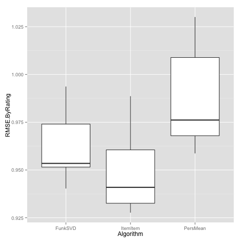

# Getting Started with the Evaluator

The LensKit evaluator lets you train algorithms over data sets, measure their
performance, and cross-validate the results for robustness.  This page
describes how to get started using the evaluator for a simple experiment.

We will use the LensKit command line tool from the binary distribution to run
the experiment.  You can also run experiments from more sophisticated build
tools such as [Gradle](http://www.gradle.org).

## Prerequisites

To run the evaluator, you'll need the following:

- Java 6 or later (Java 7 or later is best).
- The [LensKit binary distribution](https://bintray.com/lenskit/lenskit-releases/lenskit/{{site.data.lenskit.version}}/view).
- A tool for analyzing the results.  For this example, we will use [R][] with [ggplot2][].
- The [MovieLens 100K](http://grouplens.org/datasets/movielens/) data set.

[R]: http://www.r-project.org/
[ggplot2]: http://cran.r-project.org/web/packages/ggplot2/index.html

## Creating the Evaluation Script

The core of an experiment is the evaluation script, typically called `eval.groovy`:




Unpack your MovieLens data set (your current directory should have an
`eval.groovy` file and a `ml-100k` directory), and run the script using the
`lenskit` program from the [binary distribution](/download/)[^1]:

```
$ lenskit eval
```

[^1]: Without any options, the `eval` LensKit command runs the evaluation
    defined in the file `eval.groovy`.  If you want to use anothe file name,
    specify it with `-f file.groovy`, just like `make`.  This is useful for having
    multiple different evaluations in the same directory.

This does does a few things:

1.  Splits the MovieLens 100K data set into 5 partitions for cross-validation.
    These partitions are stored under `ml-100k-crossfold`.
2.  Generates predictions for test user/item pairs using three algorithms:
    personalized mean, item-item CF, and Funk-SVD.
3.  Evaluates these two algorithms with three metric families: coverage, RMSE,
    and nDCG.
4.  Writes the evaluation results to `eval-results.csv`, one row for
    each combination of algorithm and fold.

## Analyzing the Output

LensKit produces a CSV file containing the evaluation results.  This can be
analyzed with your choice of tool, for example R:



This will produce a box plot of per-user RMSE:



## Further Reading

- This whole project can be [cloned from GitHub](https://github.com/lenskit/simple-eval-demo/).
- [Walk through the eval script](../walkthrough/)
- [Example code integrating a LensKit evaluation with custom Java code](https://github.com/lenskit/eval-quickstart)
